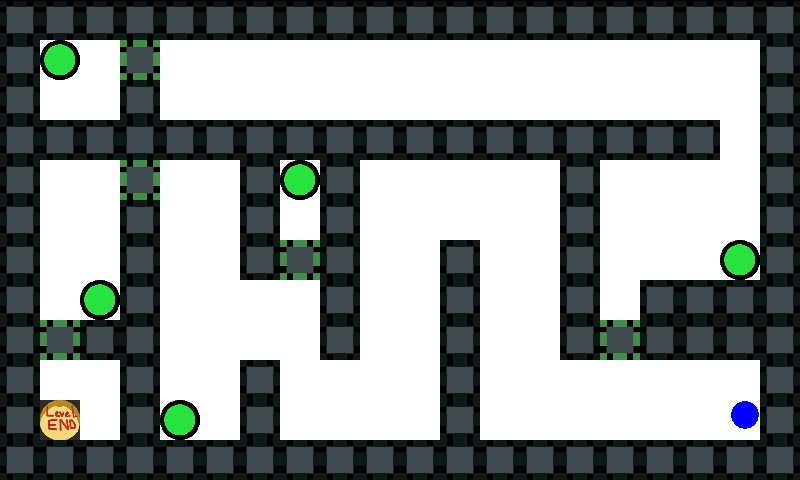
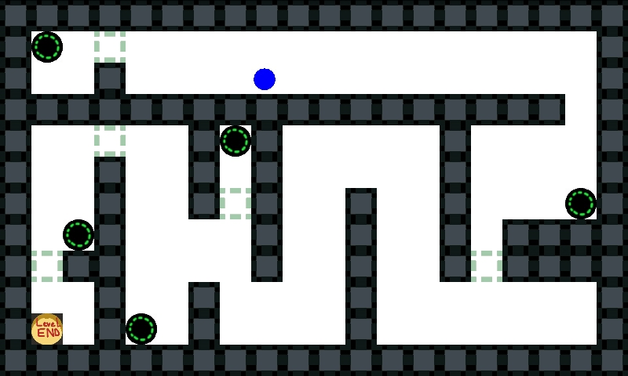

# WindowsPhoneMazeGame
 A game designed for windows phone utilising the gyroscope and accelerometer. This is developed using XNA and is ported from the Android version found at: https://github.com/Squirrelbear/AndroidMazeGame

